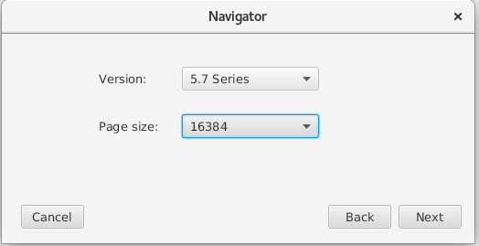
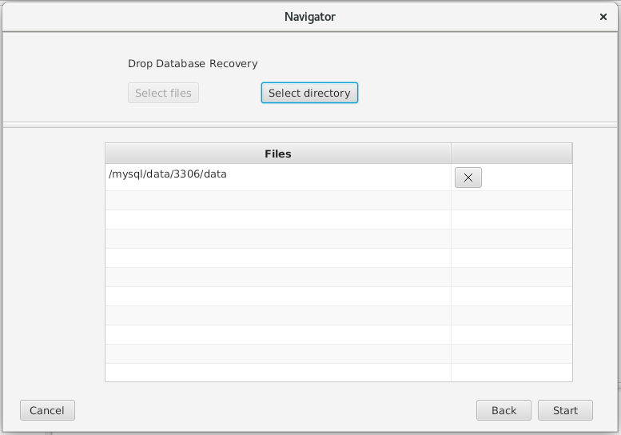
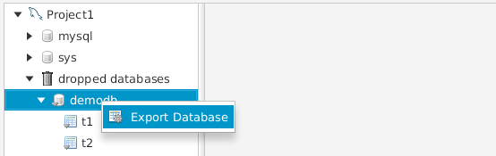

                                Without binlog and backup, how to recover the mistakenly deleted database？

   This case comes from a customer of Kenya, when he told me that his colleague deleted a business database by mistake. This database contains thousands of tables, and the accumulated data is about 50GB.
   At that time, my first thought was that it was not difficult to recover data with binlog or backup, but after my inquiry, I found that binlog was not opened and there was no backup.
   Before they came to me, they found an engineer who did data recovery, and they recovered their physical files. The tool used was PhotoRec, but the table structure files were not completely recovered. After the table structure files and data files were recovered, they were files composed of random numbers, such as 12312623523.frm and 632466423.ibd; Unable to find the corresponding relationship. When I checked the ibd file, I found that the page of idb file was damaged and could not be repaired. Anyone who is familiar with mysql should know the underlying logic of mysql. If the page is damaged, it is basically impossible to recover the data.

So how do we recover the data after deleting the database? Mysql database without binlog and backup.

1.Prepare the demo
```sql
mysql> create database demodb;
mysql> use demodb;
mysql> create table t1 select host,user from mysql.user;
mysql> create table t2 select host,db from mysql.db;
mysql> commit;

mysql> show tables;
+------------------+
| Tables_in_demodb |
+------------------+
| t1               |
| t2               |
+------------------+
2 rows in set (0.00 sec)
```

2.Check binlog status and data files.
```sql
mysql> show variables like 'log_bin';
+---------------+-------+
| Variable_name | Value |
+---------------+-------+
| log_bin       | OFF   |
+---------------+-------+
1 row in set (0.00 sec)
```

```sql
mysql> system ls -lsa /mysql/data/3306/data/demodb/*
 4 -rw-r----- 1 mysql mysql    67 Sep 23 13:41 /mysql/data/3306/data/demodb/db.opt
12 -rw-r----- 1 mysql mysql  8590 Sep 23 13:41 /mysql/data/3306/data/demodb/t1.frm
96 -rw-r----- 1 mysql mysql 98304 Sep 23 13:42 /mysql/data/3306/data/demodb/t1.ibd
12 -rw-r----- 1 mysql mysql  8586 Sep 23 13:44 /mysql/data/3306/data/demodb/t2.frm
96 -rw-r----- 1 mysql mysql 98304 Sep 23 13:44 /mysql/data/3306/data/demodb/t2.ibd
```

3.Simulated false deletion of database
```sql
mysql> drop database demodb;
mysql> commit;
```

4.Check the table, database and files, all of which do not exist.
```sql
mysql> show tables;
ERROR 1046 (3D000): No database selected
mysql> show databases;
+--------------------+
| Database           |
+--------------------+
| information_schema |
| mysql              |
| performance_schema |
| sys                |
+--------------------+
4 rows in set (0.00 sec)

mysql> system ls -lsa /mysql/data/3306/data/demodb/*
ls: cannot access /mysql/data/3306/data/demodb/*: No such file or directory
```
###Recover data

1.First, we choose the recovery mode.\
\
2.Select database version and page size.\
\
3.Select the data directory to start data recovery.\
\
4.Export the deleted database\
\
5.After that, an sql file will be generated in the directory, which is the same as the data name，demodb.sql

###Import data file
```sql
[root@mydb 20220923140624]# mysql -uroot -proot
mysql> create database demodb;
mysql> commit;
mysql> exit

[root@mydb 20220923140624]# mysql -uroot -proot -Ddemodb < demodb.sql
mysql: [Warning] Using a password on the command line interface can be insecure.
```

###Check the result
```sql
[root@mydb 20220923140624]# mysql -uroot -proot
mysql> use demodb;
mysql> show tables;
+------------------+
| Tables_in_demodb |
+------------------+
| t1               |
| t2               |
+------------------+
2 rows in set (0.00 sec)

mysql> select * from t1;
+-----------+---------------+
| host      | user          |
+-----------+---------------+
| localhost | mysql.session |
| localhost | mysql.sys     |
| localhost | root          |
+-----------+---------------+
3 rows in set (0.01 sec)

mysql> select * from t2;
+-----------+--------------------+
| host      | db                 |
+-----------+--------------------+
| localhost | performance_schema |
| localhost | sys                |
+-----------+--------------------+
2 rows in set (0.00 sec)

mysql>
```

