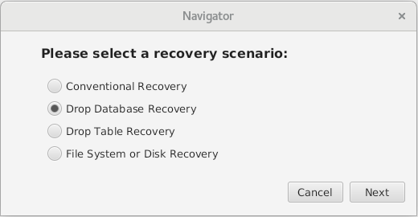

没有备份和binlog日志，如何恢复误删除的表？

该案例来自一位Kenya的客户，当时他告诉我他的同事误删除了一个业务数据库，这个数据库包含几千张表，累计数据约50GB，

当时我的第一想法是有binlog或者备份的情况下，恢复数据并不是难事，但是在我询问之下发现binlog没有开启，并且没有备份。


在找我之前他们找了一位做数据恢复的工程师，给他们做了物理文件的恢复，结果是表结构文件未能完全恢复，表结构文件和数据文件恢复之后是随机数字构成的文件，如12312623523.frm和632466423.ibd;无法找到对应的关系。当我检查ibd文件的时候，发现idb文件的page已经损坏且无法修复，熟悉mysql的人应该都清楚mysql的底层逻辑，再page损坏的情况下，基本上不可能再恢复数据了。


那么我们再删除数据库之后要如何恢复数据呢？mysql数据库没有开启binlog和没有备份的情况下。

1.环境准备

```sql
mysql> create database demodb;
mysql> use demodb;
mysql> create table t1 select host,user from mysql.user;
mysql> create table t2 select host,db from mysql.db;
mysql> commit;

mysql> show tables;
+------------------+
| Tables_in_demodb |
+------------------+
| t1               |
| t2               |
+------------------+
2 rows in set (0.00 sec)
```

2.检查binlog情况以及数据文件

```sql
mysql> show variables like 'log_bin';
+---------------+-------+
| Variable_name | Value |
+---------------+-------+
| log_bin       | OFF   |
+---------------+-------+
1 row in set (0.00 sec)
```

```sql
mysql> system ls -lsa /mysql/data/3306/data/demodb/*
 4 -rw-r----- 1 mysql mysql    67 Sep 23 13:41 /mysql/data/3306/data/demodb/db.opt
12 -rw-r----- 1 mysql mysql  8590 Sep 23 13:41 /mysql/data/3306/data/demodb/t1.frm
96 -rw-r----- 1 mysql mysql 98304 Sep 23 13:42 /mysql/data/3306/data/demodb/t1.ibd
12 -rw-r----- 1 mysql mysql  8586 Sep 23 13:44 /mysql/data/3306/data/demodb/t2.frm
96 -rw-r----- 1 mysql mysql 98304 Sep 23 13:44 /mysql/data/3306/data/demodb/t2.ibd
```

3.模拟业务误删除的情况

```sql
mysql> drop database demodb;
mysql> commit;
```

4.检查表，数据库以及文件均不存在了

```sql
mysql> show tables;
ERROR 1046 (3D000): No database selected
mysql> show databases;
+--------------------+
| Database           |
+--------------------+
| information_schema |
| mysql              |
| performance_schema |
| sys                |
+--------------------+
4 rows in set (0.00 sec)

mysql> system ls -lsa /mysql/data/3306/data/demodb/*
ls: cannot access /mysql/data/3306/data/demodb/*: No such file or directory
```

现在我们来做数据恢复

1.首先我们选择恢复模式\



```sql
[root@mydb 20220923140624]# mysql -uroot -proot
mysql> create database demodb;
mysql> commit;
mysql> exit

[root@mydb 20220923140624]# mysql -uroot -proot -Ddemodb < demodb.sql
mysql: [Warning] Using a password on the command line interface can be insecure.

[root@mydb 20220923140624]# mysql -uroot -proot
mysql> use demodb;
mysql> show tables;
+------------------+
| Tables_in_demodb |
+------------------+
| t1               |
| t2               |
+------------------+
2 rows in set (0.00 sec)

mysql> select * from t1;
+-----------+---------------+
| host      | user          |
+-----------+---------------+
| localhost | mysql.session |
| localhost | mysql.sys     |
| localhost | root          |
+-----------+---------------+
3 rows in set (0.01 sec)

mysql> select * from t2;
+-----------+--------------------+
| host      | db                 |
+-----------+--------------------+
| localhost | performance_schema |
| localhost | sys                |
+-----------+--------------------+
2 rows in set (0.00 sec)

mysql>
```

