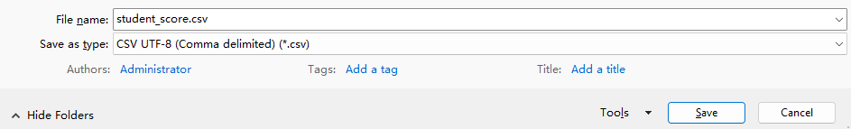

```sql
                                            How to import data from Excel table into MySQL
```

This case comes from a customer of Egypt. At that time, he told me that he made an error when importing the data in excel form into mysql. The error information is as follows:

```sql
mysql> load data infile '/mysql/loaddata/aws_mem.csv' into table aws_mem fields terminated by ',' ignore 1 lines;
ERROR 1265 (01000): Data truncated for column 'No_of' at row 1
```

This error, whether using load data or workbench import, is reported as ERROR 1265 (01000). The customer requires that the data be imported into the database without changing the table structure and csv file.

So let's disassemble the task first:

1. How to import non-empty data into the database?

2. How to import data into the database without changing the table structure and csv file in the case of ERROR 1265 (01000).


Task 1:

Under the condition that all the data in the excel table are not empty,How to import data from Excel table into MySQL？

1. Environmental preparation

```sql
mysql> create database demodb;
mysql> use demodb;
mysql> create table student_score (
    ->  id int(10) unsigned not null,
    ->  name varchar(10) not null,
    ->  score smallint unsigned not null,
    ->  primary key (id)) engine = innodb charset = utf8mb4;
Query OK, 0 rows affected (0.01 sec)

mysql> commit;
```

2. Check the parameter values of secure_file_priv and autocommit

```sql
mysql> show variables like 'secure_file_priv';
+------------------+------------------+
| Variable_name    | Value            |
+------------------+------------------+
| secure_file_priv | /mysql/loaddata/ |
+------------------+------------------+
1 row in set (0.00 sec)

mysql> show variables like 'autocommit';
+---------------+-------+
| Variable_name | Value |
+---------------+-------+
| autocommit    | ON    |
+---------------+-------+
1 row in set (0.00 sec)
```

3. Convert excel form into csv format
\

4. Upload the csv form to the secure_file_priv directory

```sql
[root@mydb ~]# cd /mysql/loaddata/
[root@mydb loaddata]# ll
total 4
-rw-r--r-- 1 mysql mysql 52 Oct  5 17:23 student_score.csv
```

Now let's import the data.

```sql
[root@mydb ~]# mysql -uroot -proot
mysql> use demodb
mysql> load data infile '/mysql/loaddata/student_score.csv' into table student_score fields terminated by ',' ignore 1 lines;
```

If the following information appears, the import is successful

```sql
Query OK, 3 rows affected (0.00 sec)
Records: 3  Deleted: 0  Skipped: 0  Warnings: 0
```

Result check

```sql
mysql> select * from student_score;
+----+-------+-------+
| id | name  | score |
+----+-------+-------+
|  1 | jerry |   100 |
|  2 | tom   |    80 |
|  3 | mike  |    60 |
+----+-------+-------+
3 rows in set (0.00 sec)
```

Task 2:

Information successfully imported:

```sql
mysql> load data infile '/mysql/loaddata/aws_mem.csv' into table aws_mem fields terminated by ',' ignore 1 lines;
Query OK, 17 rows affected, 323 warnings (0.01 sec)
Records: 17  Deleted: 0  Skipped: 0  Warnings: 323
```

I hope you can solve it yourself. Tips: It's related to mysql parameters. If you have any questions, please leave a message.
