```sql
                                 How to install PostgreSQL 15 on windows server 2019 step by step
```

Recently, a friend from the community wanted to test the latest postgresql 15 on windows server 2019, but there were some problems during installation due to the locale settings. For this reason, I have this article.

The following are the links and versions of the required software.

| Software       | 下载连接                                                     | Version |
| -------------- | :----------------------------------------------------------- | :------ |
| PostgreSQL     | https://www.postgresql.org/                                  | 15.0    |
| Windows Server | https://www.microsoft.com/en-us/evalcenter/evaluate-windows-server-2019 | 2019    |


1.Basic settings on the win-server 2019 operating system
```sql
IP Address：192.168.5.161
Firewall：OFF
Hostname:pgdb01
Hosts file:
# localhost name resolution is handled within DNS itself.
	127.0.0.1       localhost
	::1             localhost
	192.168.5.161	pgdb01
```

2.Install the PG database<br/>
2.1 Double-click the installer for the pg database<br/>
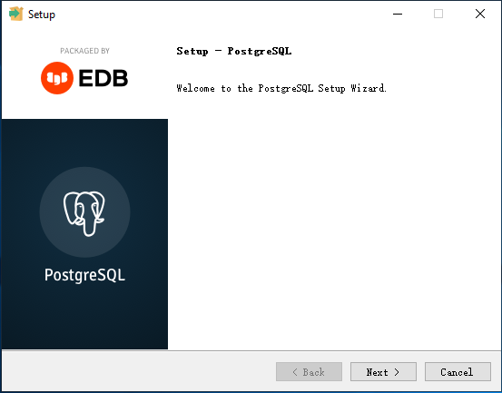<br/>
2.2 The installation directory of the installer, enter: D:\postgresql\pg15<br/>
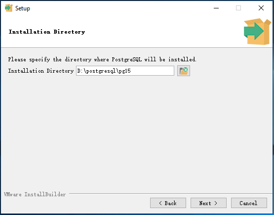<br/>
2.3 select components,all checked by default, you can also choose according to the situation<br/>
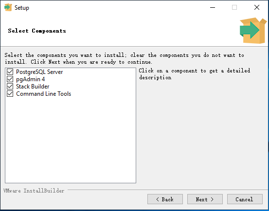<br/>
2.4 Data directory: D:\postgresql\data<br/>
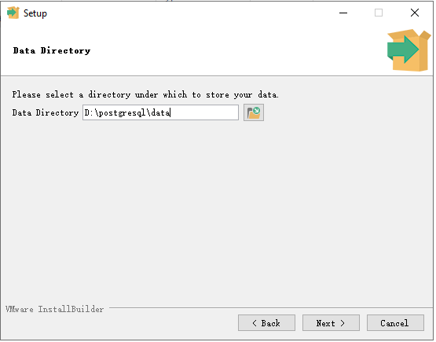<br/>
2.5 Set the password for superuser postgres: postgres<br/>
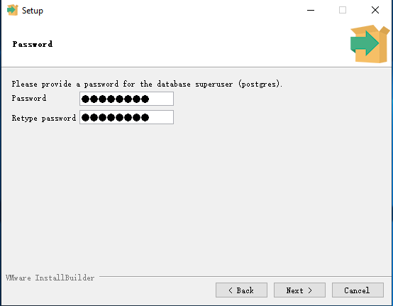<br/>
2.6 Set the access port of the database: default 5432<br/>
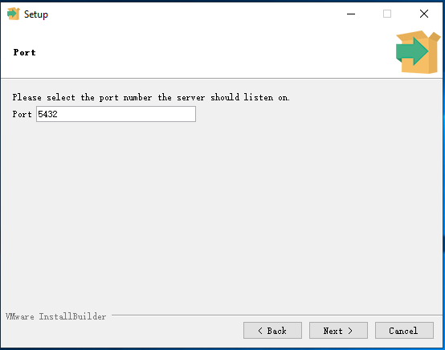<br/>
2.7 Set the Locale property of the database, here select English, United States, <br/>
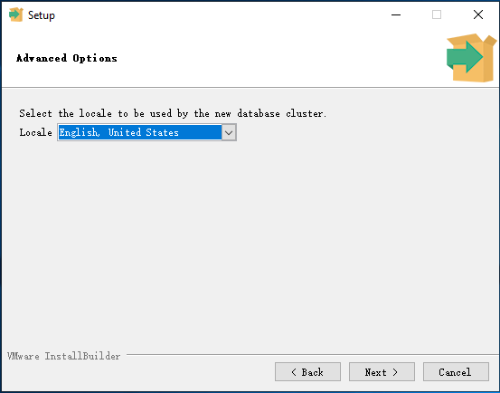<br/>
it is recommended to select C or default

2.8 Summary of pre-installation information, just record the location of the installation log<br/>
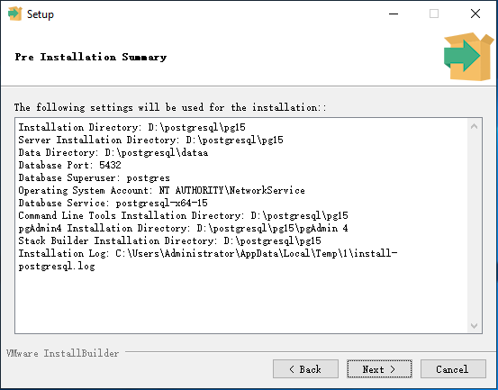<br/>
2.9 ready to install<br/>
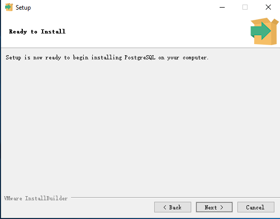<br/>
2.10 Installing,Check the log for errors<br/>
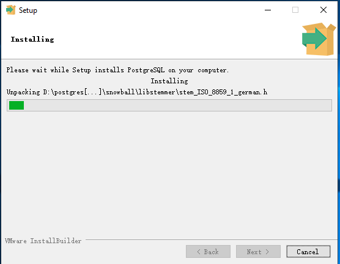<br/>
2.11 Complete the installation, uncheck Start Stack<br/>
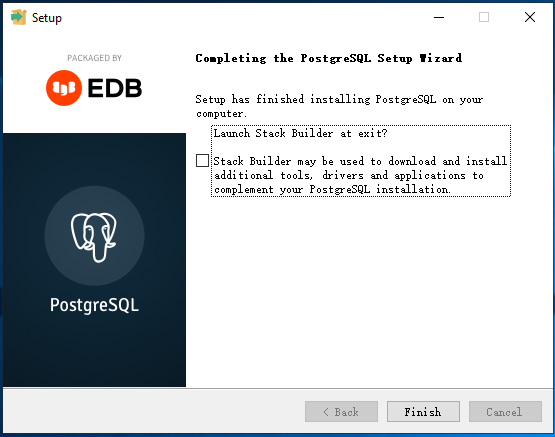<br/>

3.Set pg_hba.conf file<br/>
Append the following to the end of the pg_hba.conf file<br/>
```sql
host	all	all	0.0.0.0/0	md5
```

 4.Log in to the test using Navicat<br/>
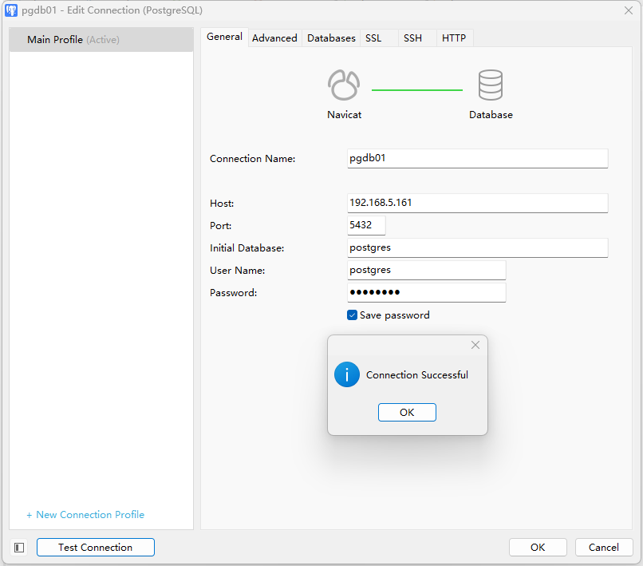<br/>

Congratulations, you have successfully completed the installation. If you have any problems during the installation, please leave a message and let me know.


